Pathfinder: Wrath of the Righteous Steam Review Data Analysis Log
================
Mike Kazantsev
2022-05-17

## Loading necessary packages

-   ggplot2
-   dplyr
-   lubridate
-   tidyverse
-   tidytext
-   tidiyr
-   stopwords
-   scales
-   stringr
-   sentimentr
-   ggwordcloud
-   ggstatsplot
-   kableExtra
-   SnowballC

Setting up environment and loading necessary packages

## Reorganizing datasets

First, I’ll merge the base game and the DLC review datasets so that
it’ll be easier to use aggregation functions and show the results of
analysis in charts.

``` r
#Loading datasets
#For Windows, R 4.2.0+ is adviced, otherwise UTF encoding might break

#basegame reviews 
basegame_cleared <- read_csv(paste0("data-clean/",AppIDs[1],".csv"), col_types=cols(
  author.steamid = col_character(),
  timestamp_created = col_datetime(format = ""),
  timestamp_updated = col_datetime(format = "")))
#dlc1 reviews
dlc1_cleared <- read_csv(paste0("data-clean/",AppIDs[2],".csv"), col_types=cols(
  author.steamid = col_character(),
  timestamp_created = col_datetime(format = ""),
  timestamp_updated = col_datetime(format = "")))

#dlc2 reviews
dlc2_cleared <- read_csv(paste0("data-clean/",AppIDs[3],".csv"), col_types=cols(
  author.steamid = col_character(),
  timestamp_created = col_datetime(format = ""),
  timestamp_updated = col_datetime(format = "")))

#Adding the game name column we'll be aggregating with later
basegame_cleared$game <- Apps[1]
dlc1_cleared$game <- Apps[2]
dlc2_cleared$game <- Apps[3]

#Adding the game bitmask for easier group calculation
basegame_cleared$game_mask <- 1
dlc1_cleared$game_mask <- 2
dlc2_cleared$game_mask <- 4


reviews_cleared <- rbind(basegame_cleared, dlc1_cleared, dlc2_cleared)
#Let's spread the author.playtime_forever, author.playtime_last_two_weeks, author.playtime_at_review, author.last_played from the base game to the dlc when it's possible:
reviews_cleared <- reviews_cleared %>% 
  group_by(author.steamid) %>% 
  mutate(author.playtime_forever = max(author.playtime_forever)) %>% 
  mutate(author.playtime_last_two_weeks = max(author.playtime_last_two_weeks)) %>% 
  mutate(author.playtime_at_review = max(author.playtime_at_review)) %>% 
  mutate(author.last_played = max(author.last_played)) %>% 
  ungroup() %>% 
  select(-1)
```

## Analyzing reviewers

### Summary table

``` r
summary_table <- reviews_cleared %>% 
  mutate(author.playtime_forever = ifelse(
    test = (author.playtime_forever == 0),
    yes = NA,
    no = author.playtime_forever
  )) %>% 
  #replace game with bitmask
  group_by(author.steamid) %>% 
  select(author.steamid,
         game,
         game_mask,
         voted_up,
         author.num_games_owned,
         author.num_reviews,
         author.playtime_forever
        ) %>% 
  mutate(game_mask_combo = sum(game_mask)) %>% 
  ungroup %>% 
  group_by(game) %>% 
  summarize(total = n(),
            voted_up = sum(voted_up == TRUE),
            author.median_num_games = median(author.num_games_owned),
            author.median_num_reviews = median(author.num_reviews),
            author.median_playtime = median(author.playtime_forever, na.rm = TRUE)/60,
            games.only_basegame = sum(game_mask_combo == 1),
            games.base_dlc1 = sum(game_mask_combo == 3),
            games.only_dlc1 = sum(game_mask_combo == 2),
            games.only_dlc2 = sum(game_mask_combo == 4),
            games.base_dlc2 = sum(game_mask_combo == 5),
            games.dlc1_dlc2 = sum(game_mask_combo == 6),
            games.base_dlc2_dlc3 = sum(game_mask_combo == 7),
            )
knitr::kable(
  select(summary_table,game:author.median_playtime),
  align = "c",
  caption = "Summary Reviews Table",
  booktabs = TRUE,
  col.names = c('Game',
                'Reviews Total:',
                'Positive Reviews',
                'Reviewers - Median Games Count',
                'Reviewers - Median Reviews Count',
                'Reviewers - Median Playtime, hours'
             )) %>% 
  kable_classic(full_width = T) %>% 
  footnote(
    general = c(
      paste("Reviewed only base game: ",max(summary_table$games.only_basegame)),
      paste("Reviewed Base Game+DLC1: ",max(summary_table$games.base_dlc1)),
      paste("Reviewed only DLC1: ",max(summary_table$games.only_dlc1)),
      paste("Reviewed only DLC2: ",max(summary_table$games.only_dlc2)),
      paste("Reviewed Base Game+DLC2: ",max(summary_table$games.base_dlc2)),
      paste("Reviewed DLC1+DLC2: ",max(summary_table$games.dlc1_dlc2)),
      paste("Reviewed all three: ",max(summary_table$games.base_dlc2_dlc3))
      )
  )
```

<table class=" lightable-classic" style="font-family: &quot;Arial Narrow&quot;, &quot;Source Sans Pro&quot;, sans-serif; margin-left: auto; margin-right: auto;border-bottom: 0;">
<caption>
Summary Reviews Table
</caption>
<thead>
<tr>
<th style="text-align:center;">
Game
</th>
<th style="text-align:center;">
Reviews Total:
</th>
<th style="text-align:center;">
Positive Reviews
</th>
<th style="text-align:center;">
Reviewers - Median Games Count
</th>
<th style="text-align:center;">
Reviewers - Median Reviews Count
</th>
<th style="text-align:center;">
Reviewers - Median Playtime, hours
</th>
</tr>
</thead>
<tbody>
<tr>
<td style="text-align:center;">
Pathfinder: Wrath of the Righteous
</td>
<td style="text-align:center;">
18863
</td>
<td style="text-align:center;">
15986
</td>
<td style="text-align:center;">
141.0
</td>
<td style="text-align:center;">
7.0
</td>
<td style="text-align:center;">
138.7667
</td>
</tr>
<tr>
<td style="text-align:center;">
WotR: Inevitable Excess
</td>
<td style="text-align:center;">
243
</td>
<td style="text-align:center;">
95
</td>
<td style="text-align:center;">
152.0
</td>
<td style="text-align:center;">
9.0
</td>
<td style="text-align:center;">
272.7667
</td>
</tr>
<tr>
<td style="text-align:center;">
WotR: Through the Ashes
</td>
<td style="text-align:center;">
192
</td>
<td style="text-align:center;">
139
</td>
<td style="text-align:center;">
188.5
</td>
<td style="text-align:center;">
15.5
</td>
<td style="text-align:center;">
289.8333
</td>
</tr>
</tbody>
<tfoot>
<tr>
<td style="padding: 0; " colspan="100%">
<span style="font-style: italic;">Note: </span>
</td>
</tr>
<tr>
<td style="padding: 0; " colspan="100%">
<sup></sup> Reviewed only base game: 18668
</td>
</tr>
<tr>
<td style="padding: 0; " colspan="100%">
<sup></sup> Reviewed Base Game+DLC1: 100
</td>
</tr>
<tr>
<td style="padding: 0; " colspan="100%">
<sup></sup> Reviewed only DLC1: 101
</td>
</tr>
<tr>
<td style="padding: 0; " colspan="100%">
<sup></sup> Reviewed only DLC2: 88
</td>
</tr>
<tr>
<td style="padding: 0; " colspan="100%">
<sup></sup> Reviewed Base Game+DLC2: 62
</td>
</tr>
<tr>
<td style="padding: 0; " colspan="100%">
<sup></sup> Reviewed DLC1+DLC2: 9
</td>
</tr>
<tr>
<td style="padding: 0; " colspan="100%">
<sup></sup> Reviewed all three: 33
</td>
</tr>
</tfoot>
</table>

### Stats boxplot

#### Using ggbetweenstats package to construct the distribution graphs and statistics on authors

``` r
author_stats_data <- reviews_cleared %>% 
  select(game,
         author.num_games_owned,
         author.num_reviews,
         author.playtime_forever)

# ggstatplot
betweenstats1 <- ggbetweenstats(
  data = author_stats_data,
  x = game,
  y = author.num_games_owned,
  title = "By games owned",
  xlab = "Game",
  ylab = "Games Owned"
)
betweenstats2 <- ggbetweenstats(
  data = author_stats_data,
  x = game,
  y = author.num_reviews,
  title = "By number of reviews",
  xlab = "Game",
  ylab = "Total Reviews"
)
betweenstats3 <- ggbetweenstats(
  data = author_stats_data,
  x = game,
  y = author.playtime_forever,
  title = "By total playtime",
  xlab = "Game",
  ylab = "Total Playtime, minutes"
)

combine_plots(
  list(betweenstats1, betweenstats2, betweenstats3),
  plotgrid.args = list(nrow = 3, ncol = 1),
  annotation.args = list(
    title = "Distribution tests for review authors",
    caption = "Using ggbetweenstats package"
  )
)
```

<!-- -->

### QQ-plot

``` r
# QQ-Plots
#filtering out data
reviews_cleared %>% 
  select(game,
         author.num_games_owned,
         author.num_reviews,
         author.playtime_forever) %>% 
  #remove outliers (2-sigma)
  filter(!(abs(author.num_games_owned - median(author.num_games_owned)) > 2*sd(author.num_games_owned))) %>%
  filter(!(abs(author.num_reviews - median(author.num_reviews)) > 2*sd(author.num_reviews))) %>% 
  filter(!(abs(author.playtime_forever - median(author.playtime_forever)) > 2*sd(author.playtime_forever))) %>% 
  gather(key, value, -game) %>% 
#making plot
  ggplot(
        aes(sample = value,
            colour = str_wrap(game,15)),
    ) + 
    stat_qq() + 
    stat_qq_line() +
    theme_bw() +
    labs(
      title = "QQ-plot for review authors",
      subtitle = "Numbers of games owned, total reviews and playtime"
    ) + 
    guides(color = guide_legend(title = "Game:", byrow = TRUE)) +
    facet_wrap(~key,
               ncol = 1,
               scale = 'free',
               labeller = labeller(
                 key = c( `author.num_games_owned` = "Games Owned",
                          `author.num_reviews` = "Total Reviews",
                          `author.playtime_forever` = "Total Playtime")
               )
    )
```

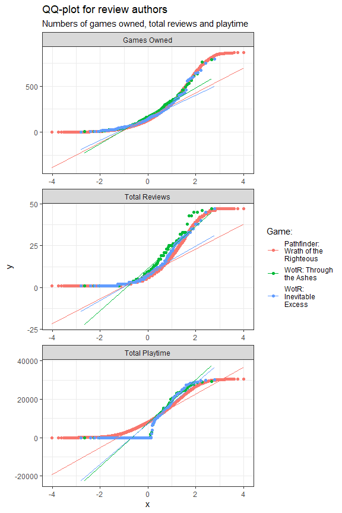<!-- -->

## Analyzing review rates

### Review changes by date

Review changes for game and DLC by date:

``` r
#Regrouping data and getting percentages of positive/negative reviews for each title/date
#Getting chart data
reviewsbydate_chart_data <- reviews_cleared %>%
  mutate(date = floor_date(timestamp_created,"month")) %>%
  group_by(date, game) %>% 
  mutate(review_count = n()) %>% 
  ungroup() %>% 
  group_by(date, game, voted_up, review_count) %>% 
  summarize(
    review_voted = n(),
  ) %>% 
  as_tibble() %>% 
  mutate(percentage = review_voted/review_count) %>% 
  select(date, game, voted_up, percentage)
#Making chart labels
reviewsbydate_chart_text <- reviewsbydate_chart_data %>% 
  group_by(game,voted_up) %>% 
  filter((percentage >= max(percentage) | percentage <= min(percentage)) 
         & voted_up == TRUE) %>% 
  mutate(label=ifelse(percentage == max(percentage),
                      paste0("Max rate - ",percent(percentage,accuracy = 0.01)),
                      paste0("Min rate - ", percent(percentage,accuracy = 0.01)))) %>% 
  ungroup
# Single line plot
reviewsbydate_chart_data %>% 
  filter(voted_up == TRUE) %>% 
  ggplot(aes(x = date, y  = percentage, colour = str_wrap(game,15))) + 
  geom_line(size = 2) +
  geom_point(size = 3) +
  labs(
    x = NULL,
    y = NULL,
    title = "Positive reviews % by date",
    subtitle = "For the base game and DLCs"
  ) +
  #  scale_fill_discrete(name = "Game:") + 
  scale_y_continuous(labels=scales::percent, limits = c(0,1)) + 
  geom_text(data = reviewsbydate_chart_text,
            aes(label = label),
            check_overlap = TRUE,
            vjust="outward",
            hjust="inward",
            size = 4
  ) + 
  theme(axis.text.x = element_text(angle = 45, hjust=1),
        legend.position = "right",
        legend.box = "vertical",
        legend.direction = "vertical",
        legend.spacing.y = unit(0.5, "cm")
  ) +
  scale_x_datetime(date_breaks = "1 month", date_labels="%b %y") +
  guides(color = guide_legend(title = "Game:", byrow = TRUE))
```

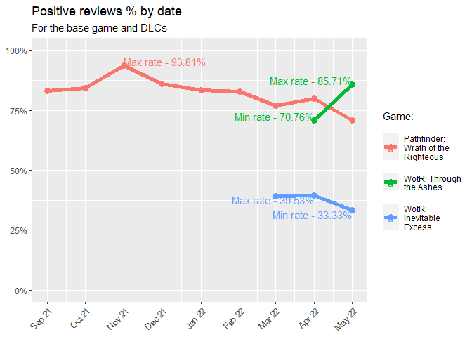<!-- -->

### Review numbers by date:

``` r
#reviews by month - numbers
reviews_cleared %>%
  mutate(date = floor_date(timestamp_created,"month")) %>%
  group_by(date, game) %>% 
  mutate(review_count = n()) %>% 
  ungroup() %>% 
  group_by(date, game, voted_up, review_count) %>% 
  summarize(
    review_voted = n(),
  ) %>% 
  as_tibble() %>% 
  #  mutate(percentage = review_voted/review_count) %>% 
  select(date, game, voted_up, review_voted) %>% 
  #Putting the plot
  ggplot(aes(x = date, y  = review_voted, fill = factor(voted_up))) + 
  geom_col(
    position="stack") +
  labs(
    x = "Date",
    y = "Reviews",
    title = "Review numbers by month"
  ) + 
  scale_fill_discrete(name = "Review:", labels=c("Negative", "Positive")) + 
  #  scale_y_continuous(labels=scales::percent) + 
  #Adding labels
  geom_text(
    aes(label = review_voted),
    position = position_stack(vjust = 0.5),
    size = 2
  ) + 
  theme(axis.text.x = element_text(angle = 45, hjust=1),
        axis.title.y = element_blank()) + 
  scale_x_datetime(date_breaks = "1 month", date_labels="%b %y") + 
  facet_wrap(~game, ncol = 1, scales = "free_y")
```

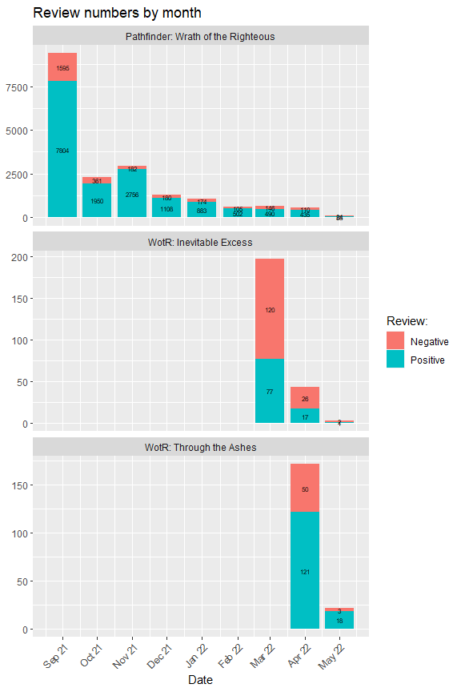<!-- -->

### High weighted reviews

Positive/negative reviews proportions for base game and DLCs:
Positive/negative percentages for the high weighted score (Filtered out
weighted score below 0.5, determines review’s helpfulness)

``` r
#High weighted reviews
plot1_data <- reviews_cleared %>% 
  filter(weighted_vote_score > 0.5) %>% 
  group_by(game) %>% 
  mutate(review_count = n()) %>% 
  ungroup() %>% 
  group_by(game, voted_up, review_count) %>% 
  summarize(
    review_voted = n(),
  ) %>% 
  as_tibble() %>% 
  mutate(percentage = review_voted/review_count) %>% 
  select(game, voted_up, percentage)
  #Putting the plot
```

``` r
ggplot(data = plot1_data, aes(x = game, y  = percentage, fill = factor(voted_up))) + 
  geom_col(
    position="stack") +
  labs(
    x = "Game",
    y = "Percentage",
    title = "Review rates for high weighted reviews",
    subtitle = "Positive/negative review rates for high weighted reviews",
    caption =paste0(strwrap("Reviews having weight score above 0.5 were considered as high weighted", 40),
                    collapse="\n"),
  ) + 
  scale_fill_discrete(name = "Review:", labels=c("Negative", "Positive")) + 
  scale_y_continuous(labels=scales::percent) + 
  #Adding labels
  geom_text(
    aes(label = percent(percentage,accuracy = 0.01)),
    position = position_fill(vjust = 0.5),
    size = 3
  ) + 
  scale_x_discrete(labels = (\(x) gsub("([^\\s]+\\s[^\\s]+)\\s","\\1\n",x,perl=TRUE))) + 
  theme(axis.text.x = element_text(vjust = 0.5, hjust=0.5),
        axis.title.x = element_blank(),
        axis.title.y = element_blank())
```

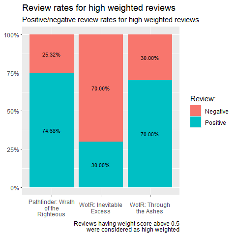<!-- -->

### Opinion changed between the base game and the DLC

As we can see, there is a significant difference between the base game
reviews and DLC reviews, and the base game has much more positive
reviews even after the DLC release. So we can assume the players are
unhappy with the DLC itself, not the game after it’s release (although
there is some drop in positive reviews for the base game as well). Let’s
see how reviews change for players that reviewed both base game and the
DLC:

``` r
#making data
#grouping by author
#spreading the game rate up/down
#summarising by game group
reviews_cleared %>% 
  group_by(author.steamid) %>% 
  filter(n() > 1) %>% 
  select(author.steamid,game,voted_up) %>% 
  spread(game,voted_up) %>% 
  mutate(vote_change01 = case_when(
    (!!sym(Apps[1]) & !!sym(Apps[2])) ~ "Remained positive",
    (!!sym(Apps[1])==TRUE & !!sym(Apps[2])==FALSE) ~ "Changed to negative from positive",
    (!!sym(Apps[1])==FALSE & !!sym(Apps[2])==TRUE) ~ "Changed to positive from negative",
    (!!sym(Apps[1])==FALSE & !!sym(Apps[2])==FALSE) ~ "Remained negative",
  ),
  vote_change02 = case_when(
    (!!sym(Apps[1]) & !!sym(Apps[3])) ~ "Remained positive",
    (!!sym(Apps[1])==TRUE & !!sym(Apps[3])==FALSE) ~ "Changed to negative from positive",
    (!!sym(Apps[1])==FALSE & !!sym(Apps[3])==TRUE) ~ "Changed to positive from negative",
    (!!sym(Apps[1])==FALSE & !!sym(Apps[3])==FALSE) ~ "Remained negative",
  ),
  vote_change12 = case_when(
    (!!sym(Apps[2]) & !!sym(Apps[3])) ~ "Remained positive",
    (!!sym(Apps[2])==TRUE & !!sym(Apps[3])==FALSE) ~ "Changed to negative from positive",
    (!!sym(Apps[2])==FALSE & !!sym(Apps[3])==TRUE) ~ "Changed to positive from negative",
    (!!sym(Apps[2])==FALSE & !!sym(Apps[3])==FALSE) ~ "Remained negative",
  )) %>% 
  select(-!!sym(Apps[1]),-!!sym(Apps[2]),-!!sym(Apps[3])) %>% 
  pivot_longer(!author.steamid,
               names_to = "games_cat",
               values_to = "vote_change") %>% 
  filter(!is.na(vote_change)) %>%
  group_by(games_cat,vote_change) %>% 
  summarise(count = n(), .groups = "drop_last") %>% 
  mutate(Percentage = count/sum(count)) %>% 
#making plot
ggplot(aes(x=vote_change, fill = str_wrap(vote_change,15), y = Percentage)) + 
  geom_col() + 
  geom_text(aes(label = percent(Percentage)), vjust = -0.25) +
  scale_fill_discrete(name = "Rate changes:") +
  labs(
    title = "Vote rate changes",
    subtitle = "Reviewers changed their opinion between the base game and the DLCs"
  ) + 
  scale_x_discrete(labels = (\(x) gsub("\\s","\n",x))) +
  scale_y_continuous(labels=scales::percent, limits = c(0,1)) +
  theme(axis.text.x = element_text(vjust = 0.5, hjust=0.5),
        axis.title.x = element_blank(),
        axis.title.y = element_blank()) + 
  facet_wrap(~games_cat,
             ncol = 1,
             labeller = labeller(
               games_cat = c(`vote_change01` = str_wrap(paste("From", Apps[1], "to", Apps[2]),40),
                        `vote_change02` = str_wrap(paste("From", Apps[1], "to", Apps[3]),40),
                        `vote_change12` = str_wrap(paste("From", Apps[2], "to", Apps[3]),40))
              )
             )
```

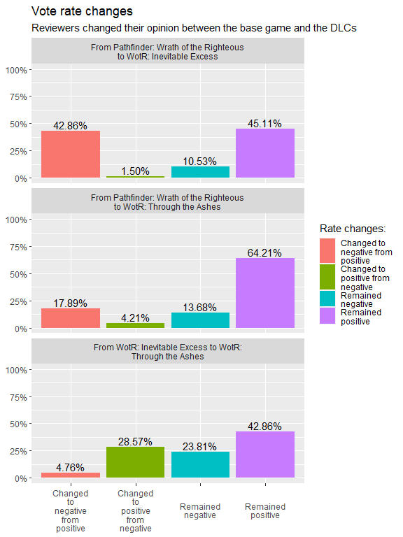<!-- -->

It seems my assumption was correct - a third of the players has changed
their opinion to the negative between the base game and the DLC.

### Reviews by playtime

Sadly, it is impossible to track the time played for the DLCs - this
data is only available to the game. Nevertheless, we may take a look at
the difference of the game perception between the long-standing players
and the new ones.

``` r
#grouping up and  getting percentages
#% of DLC reviewers not reviewed the base game
not_reviewed_basegame <- reviews_cleared %>% 
  filter(author.playtime_forever == 0) %>% 
  nrow()/nrow(reviews_cleared %>% filter(game == Apps[2] || game == Apps[3]))
#% of DLC reviewers played 50 hours and more
longplayed_reviewers <- reviews_cleared %>% 
  filter(author.playtime_forever >= 3000 & (game == Apps[2] || game == Apps[3])) %>% 
  nrow()/nrow(reviews_cleared %>% filter(game == Apps[2] || game == Apps[3]))

reviews_cleared %>%
  mutate(playtime_group = case_when(
           (author.playtime_forever == 0) ~ "Didn't review the base game",
           (author.playtime_forever < 600 & author.playtime_forever > 0) ~ "Less than 10 hours played total",
           (author.playtime_forever < 3000 & author.playtime_forever >= 600) ~"Between 10 and 50 hours played total",
           (author.playtime_forever >= 3000) ~"50 and more hours played total")) %>%
  group_by(playtime_group, game) %>% 
  mutate(review_count = n()) %>% 
  ungroup() %>% 
  group_by(playtime_group, game, voted_up, review_count) %>% 
  summarize(
    review_voted = n(),
  ) %>%
  as_tibble() %>% 
  mutate(percentage = review_voted/review_count) %>% 
  select(playtime_group, game, voted_up, percentage) %>% 
  #Putting the plot
  ggplot(aes(x = playtime_group, y  = percentage, fill = factor(voted_up))) + 
  geom_col(
    position="stack") +
  labs(
    x = "Playtime",
    y = "Percentage",
    title = "Reviews by playtime",
    subtitle = "Review rates for different playtimes",
    caption = paste0(percent(not_reviewed_basegame, accuracy = 0.01)," reviewers only reviewed the DLC")
  ) + 
  scale_fill_discrete(name = "Review:", labels=c("Negative", "Positive")) + 
  scale_y_continuous(labels=scales::percent) + 
  #Adding labels
  geom_text(
    aes(label = percent(percentage,accuracy = 0.01)),
    position = position_fill(vjust = 0.5),
    size = 3
  ) + 
  scale_x_discrete(labels = (\(x) gsub("([^\\s]+\\s[^\\s]+)\\s","\\1\n",x,perl=TRUE)))  + 
  theme(axis.text.x = element_text(vjust = 0.5, hjust=0.5),
        axis.title.x = element_blank(),
        axis.title.y = element_blank()) +
  facet_wrap(~game, ncol = 1)
```

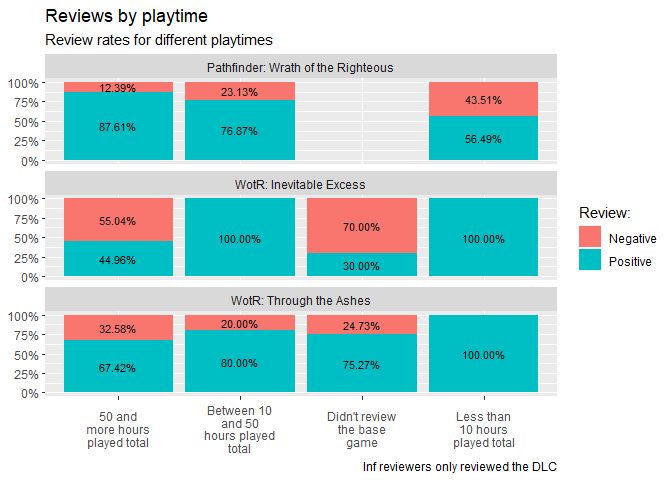<!-- -->

Interestingly, the players that have played the game the most, have more
positive reviews. Also take a note at the people that didn’t review the
base game (2037 out of 3644 DLC reviews, *59.9%*).

### Reviews by games owned

Another piece of data that might offer some insights is the difference
between players owning different number of games:

``` r
#Players owning different number of games
reviews_cleared %>%
  mutate(gamesowned_group = case_when(
    (author.num_games_owned >= 0 & author.num_games_owned < 50) ~ "Less than 50 games owned",
    (author.num_games_owned >= 50 & author.num_games_owned < 100) ~ "Between 50 and 100 games owned",
    (author.num_games_owned >= 100 & author.num_games_owned < 150) ~ "Between 100 and 150 games owned",
    (author.num_games_owned >= 150) ~"150 and more games owned")) %>%
  group_by(gamesowned_group, game) %>% 
  mutate(review_count = n()) %>% 
  ungroup() %>% 
  group_by(gamesowned_group, game, voted_up, review_count) %>% 
  summarize(
    review_voted = n(),
  ) %>% 
  as_tibble() %>% 
  mutate(percentage = review_voted/review_count) %>% 
  select(gamesowned_group, game, voted_up, percentage) %>% 
  #Putting the plot
  ggplot(aes(x = gamesowned_group, y  = percentage, fill = factor(voted_up))) + 
  geom_col(
    position="stack") +
  labs(
    x = "Playtime",
    y = "Percentage",
    title = "Reviews by games owned",
    subtitle = "Number of games owned by reviewers"
  ) + 
  scale_fill_discrete(name = "Review:", labels=c("Negative", "Positive")) + 
  scale_y_continuous(labels=scales::percent) + 
  #Adding labels
  geom_text(
    aes(label = percent(percentage,accuracy = 0.01)),
    position = position_fill(vjust = 0.5),
    size = 3
  ) + 
  scale_x_discrete(labels = (\(x) gsub("([^\\s]+\\s[^\\s]+)\\s","\\1\n",x,perl=TRUE)))  + 
  theme(axis.text.x = element_text(vjust = 0.5, hjust=0.5),
        axis.title.x = element_blank(),
        axis.title.y = element_blank()) +
  facet_wrap(~game, ncol = 1)
```

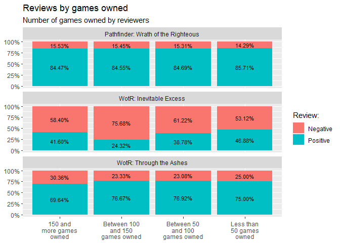<!-- -->

While this stat is interesting, the difference doesn’t seem to be big
enough for any insights. It might be interesting to analyse the
reviewers profiles for what games they own though.

### Reviews by total number of reviews written:

Also, let’s see how review scores differ between the active/inactive
review writers:

``` r
#Reviews by the player writing activities
reviews_cleared %>%
  mutate(reviews_group = case_when(
    (author.num_reviews >= 0 & author.num_reviews < 10) ~ "Less than 10 games reviewed",
    (author.num_reviews >= 10 & author.num_reviews < 50) ~ "Between 10 and 50 games reviewed",
    (author.num_reviews >= 50) ~"50 and more games reviewed")) %>%
  group_by(reviews_group, game) %>% 
  mutate(review_count = n()) %>% 
  ungroup() %>% 
  group_by(reviews_group, game, voted_up, review_count) %>% 
  summarize(
    review_voted = n(),
  ) %>% 
  as_tibble() %>% 
  mutate(percentage = review_voted/review_count) %>% 
  select(reviews_group, game, voted_up, percentage) %>% 
  #Putting the plot
  ggplot(aes(x = reviews_group, y  = percentage, fill = factor(voted_up))) + 
  geom_col(
    position="stack") +
  labs(
    x = "Playtime",
    y = "Percentage",
    title = "Reviews by total reviews written",
    subtitle = "Number of reviews written by reviewers"
  ) + 
  scale_fill_discrete(name = "Review:", labels=c("Negative", "Positive")) + 
  scale_y_continuous(labels=scales::percent) + 
  #Adding labels
  geom_text(
    aes(label = percent(percentage,accuracy = 0.01)),
    position = position_fill(vjust = 0.5),
    size = 3
  ) + 
  scale_x_discrete(labels = (\(x) gsub("([^\\s]+\\s[^\\s]+)\\s","\\1\n",x,perl=TRUE)))  + 
  theme(axis.text.x = element_text(vjust = 0.5, hjust=0.5),
        axis.title.x = element_blank(),
        axis.title.y = element_blank()) +
  facet_wrap(~game, ncol = 1)
```

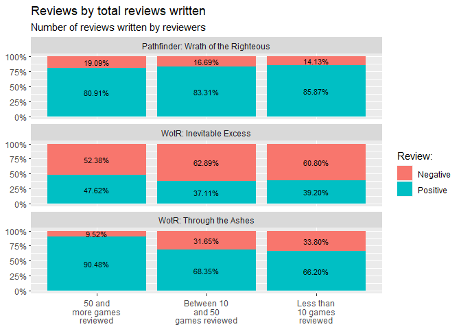<!-- -->

It seems we have an interesting correlation here - players that have the
higher number of reviews see the base game more negatively, while the
opposite is true for the DLC. This might indicate the players are more
dissatisfied enough to write the negative review for the first time.

## Reviews with texts summary

Let’s take a look at how reviews (and their authors) with the text are
different from the reviews without text:

### Summary table

``` r
summary_table_text <- reviews_cleared %>% 
  filter(language == "english") %>% 
  filter(nchar(review_text, type="chars") > 0) %>%
  mutate(author.playtime_forever = ifelse(
    test = (author.playtime_forever == 0),
    yes = NA,
    no = author.playtime_forever
  )) %>% 
  #replace game with bitmask
  group_by(author.steamid) %>% 
  select(author.steamid,
         game,
         game_mask,
         voted_up,
         author.num_games_owned,
         author.num_reviews,
         author.playtime_forever
        ) %>% 
  mutate(game_mask_combo = sum(game_mask)) %>% 
  ungroup %>% 
  group_by(game) %>% 
  summarize(total_text = n(),
            voted_up = sum(voted_up == TRUE),
            author.median_num_games = median(author.num_games_owned),
            author.median_num_reviews = median(author.num_reviews),
            author.median_playtime = median(author.playtime_forever, na.rm = TRUE)/60
            ) %>% 
  #adding total values from the summary_table
  cbind(summary_table["total"]) %>% 
  mutate(percentage = percent(total_text/total,accuracy = 0.01)) %>% 
  select(-total) %>% 
  select(game,
         total_text,
         percentage,
         voted_up,
         author.median_num_games,
         author.median_num_reviews,
         author.median_playtime)

#printing table
knitr::kable(
  select(summary_table_text,game:author.median_playtime),
  align = "c",
  caption = "Summary Table for reviews with text",
  booktabs = TRUE,
  col.names = c('Game',
                'Reviews With Text:',
                '% of Total Reviews ',
                'Positive Reviews',
                'Reviewers - Median Games Count',
                'Reviewers - Median Reviews Count',
                'Reviewers - Median Playtime, hours'
             )) %>% 
  kable_classic(full_width = T)
```

<table class=" lightable-classic" style="font-family: &quot;Arial Narrow&quot;, &quot;Source Sans Pro&quot;, sans-serif; margin-left: auto; margin-right: auto;">
<caption>
Summary Table for reviews with text
</caption>
<thead>
<tr>
<th style="text-align:center;">
Game
</th>
<th style="text-align:center;">
Reviews With Text:
</th>
<th style="text-align:center;">
% of Total Reviews
</th>
<th style="text-align:center;">
Positive Reviews
</th>
<th style="text-align:center;">
Reviewers - Median Games Count
</th>
<th style="text-align:center;">
Reviewers - Median Reviews Count
</th>
<th style="text-align:center;">
Reviewers - Median Playtime, hours
</th>
</tr>
</thead>
<tbody>
<tr>
<td style="text-align:center;">
Pathfinder: Wrath of the Righteous
</td>
<td style="text-align:center;">
10689
</td>
<td style="text-align:center;">
56.67%
</td>
<td style="text-align:center;">
8903
</td>
<td style="text-align:center;">
168.0
</td>
<td style="text-align:center;">
6
</td>
<td style="text-align:center;">
146.5500
</td>
</tr>
<tr>
<td style="text-align:center;">
WotR: Inevitable Excess
</td>
<td style="text-align:center;">
142
</td>
<td style="text-align:center;">
58.44%
</td>
<td style="text-align:center;">
52
</td>
<td style="text-align:center;">
171.5
</td>
<td style="text-align:center;">
9
</td>
<td style="text-align:center;">
275.9167
</td>
</tr>
<tr>
<td style="text-align:center;">
WotR: Through the Ashes
</td>
<td style="text-align:center;">
122
</td>
<td style="text-align:center;">
63.54%
</td>
<td style="text-align:center;">
86
</td>
<td style="text-align:center;">
233.5
</td>
<td style="text-align:center;">
18
</td>
<td style="text-align:center;">
300.2833
</td>
</tr>
</tbody>
</table>

### QQ-plot

``` r
#getting data for reviews with text
text_test_data <- reviews_cleared %>% 
  #remove outliers (2-sigma)
  filter(!(abs(author.num_games_owned - median(author.num_games_owned)) > 2*sd(author.num_games_owned))) %>%
  filter(!(abs(author.num_reviews - median(author.num_reviews)) > 2*sd(author.num_reviews))) %>% 
  filter(!(abs(author.playtime_forever - median(author.playtime_forever)) > 2*sd(author.playtime_forever))) %>% 
  filter(language == "english") %>% 
  filter(nchar(review_text, type="chars") > 0) %>%
  select(
        game,
        author.num_games_owned,
        author.num_reviews,
        author.playtime_forever
  ) %>% 
  mutate(source = "Reviews with text")
#merging with all reviews
text_test_data<-bind_rows(text_test_data,author_stats_data) %>% 
  replace_na(list(source = "All reviews"))

text_test_data %>% 
  select(-game) %>% 
  gather(key, value, -source) %>% 
#making plot
  ggplot(
    aes(sample = value,
        colour = source),
  ) + 
  stat_qq() + 
  stat_qq_line() +
  theme_bw() +
  labs(
    title = "QQ-plot for reviews with text",
    subtitle = "Numbers of games owned, total reviews and playtime"
  ) + 
  guides(color = guide_legend(title = "Datasets:",
                              byrow = TRUE,
                              )) +
  facet_wrap(~key,
             ncol = 1,
             scale = 'free',
             labeller = labeller(
               key = c( `author.num_games_owned` = "Games Owned",
                        `author.num_reviews` = "Total Reviews",
                        `author.playtime_forever` = "Total Playtime")
             )
  )
```

<!-- -->

## Reviews word frequency analysis

First I’ll tokenize the review texts for both the base game and the DLC
using unnest_tokens from the tidytext package and remove the stop words.
I’ve selected only English language since it’s the largest language
group and it’s not possible to analyze the frequencies properly across
multiple languages. After that I do stemming and group words by stemmed
values, using them to determine the frequency.

``` r
game_freq_pos <- basegame_cleared %>%
  ungroup() %>% 
  filter(language == "english") %>% 
  filter(nchar(review_text, type="chars") > 0) %>%
  select(review_id,voted_up,timestamp_created,review_text) %>% 
  unnest_tokens(review_words, review_text) %>% 
  anti_join(as_tibble(stopwords("en")),by=c("review_words" = "value")) %>% 
  mutate (words_stem = wordStem(review_words, language = "en")) %>% 
  group_by(review_words) %>% 
  mutate(words_count = n()) %>%
  ungroup %>% 
  group_by(words_stem) %>% 
  mutate(review_words = review_words[which.max(words_count)]) %>% 
  ungroup() %>% 
  select(-words_count,-words_stem)

dlc_freq_pos <- dlc1_cleared %>%
  ungroup() %>% 
  filter(language == "english") %>% 
  filter(nchar(review_text, type="chars") > 0) %>%
  select(review_id,voted_up,timestamp_created,review_text) %>% 
  unnest_tokens(review_words, review_text) %>% 
  anti_join(as_tibble(stopwords("en")),by=c("review_words" = "value")) %>% 
  mutate (words_stem = wordStem(review_words, language = "en")) %>% 
  group_by(review_words) %>% 
  mutate(words_count = n()) %>%
  ungroup %>% 
  group_by(words_stem) %>% 
  mutate(review_words = review_words[which.max(words_count)]) %>% 
  ungroup() %>% 
  select(-words_count,-words_stem)

dlc2_freq_pos <- dlc2_cleared %>%
  ungroup() %>% 
  filter(language == "english") %>% 
  filter(nchar(review_text, type="chars") > 0) %>%
  select(review_id,voted_up,timestamp_created,review_text) %>% 
  unnest_tokens(review_words, review_text) %>% 
  anti_join(as_tibble(stopwords("en")),by=c("review_words" = "value")) %>% 
  mutate (words_stem = wordStem(review_words, language = "en")) %>% 
  group_by(review_words) %>% 
  mutate(words_count = n()) %>%
  ungroup %>% 
  group_by(words_stem) %>% 
  mutate(review_words = review_words[which.max(words_count)]) %>% 
  ungroup() %>% 
  select(-words_count,-words_stem)
```

### Word clouds for positive and negative reviews for the base game and the dlcs:

#### Base game:

``` r
set.seed(1)
#Base game
#Grouping up and counting
game_freq_pos %>%
  mutate(review_group = case_when(
    (voted_up == TRUE) ~ "Positive reviews",
    (voted_up == FALSE) ~ "Negative reviews")) %>%
  group_by(review_group) %>% 
  count(review_words, sort = TRUE) %>%
  rename(word_count = n) %>% 
  mutate(count_normalise = word_count/sum(word_count)) %>% 
  slice_max(count_normalise,n = 50, with_ties = FALSE) %>% 
  as_tibble() %>% 
  #makig plot
  ggplot(aes(label = review_words,
             color = review_group,
             size = count_normalise,
             alpha = count_normalise
  )
  ) +
  geom_text_wordcloud_area() + 
  labs(
    title = paste("Word cloud for", Apps[1]),
    caption = "Created using tidytext tokenization"
  ) +
  scale_size_area(max_size = 20) +
  theme_minimal() +
  scale_alpha_continuous(range = c(0.6,1)) +
  scale_fill_brewer(palette = "Set1"
                    , name = "review_group") +
  facet_wrap(~review_group)
```

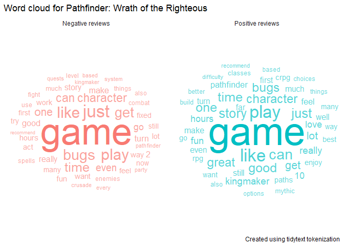<!-- -->

#### DLC1:

``` r
set.seed(1)
#Base game
#Grouping up and counting
dlc_freq_pos %>%
  mutate(review_group = case_when(
    (voted_up == TRUE) ~ "Positive reviews",
    (voted_up == FALSE) ~ "Negative reviews")) %>%
  group_by(review_group) %>% 
  count(review_words, sort = TRUE) %>%
  rename(word_count = n) %>% 
  mutate(count_normalise = word_count/sum(word_count)) %>% 
  slice_max(count_normalise,n = 50, with_ties = FALSE) %>% 
  as_tibble() %>% 
  #makig plot
  ggplot(aes(label = review_words,
             color = review_group,
             size = count_normalise,
             alpha = count_normalise
  )
  ) +
  geom_text_wordcloud_area() + 
  labs(
    title = paste("Word cloud for", Apps[2]),
    caption = "Created using tidytext tokenization"
  ) +
  scale_size_area(max_size = 20) +
  theme_minimal() +
  scale_alpha_continuous(range = c(0.6,1)) +
  scale_fill_brewer(palette = "Set1"
                    , name = "review_group") +
  facet_wrap(~review_group)
```

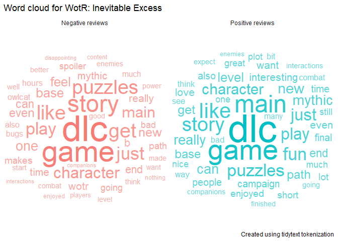<!-- -->

#### And DLC2:

``` r
set.seed(1)
#Base game
#Grouping up and counting
dlc2_freq_pos %>%
  mutate(review_group = case_when(
    (voted_up == TRUE) ~ "Positive reviews",
    (voted_up == FALSE) ~ "Negative reviews")) %>%
  group_by(review_group) %>% 
  count(review_words, sort = TRUE) %>%
  rename(word_count = n) %>% 
  mutate(count_normalise = word_count/sum(word_count)) %>% 
  slice_max(count_normalise,n = 50, with_ties = FALSE) %>% 
  as_tibble() %>% 
  #makig plot
  ggplot(aes(label = review_words,
             color = review_group,
             size = count_normalise,
             alpha = count_normalise
  )
  ) +
  geom_text_wordcloud_area() + 
  labs(
    title = paste("Word cloud for", Apps[3]),
    caption = "Created using tidytext tokenization"
  ) +
  scale_size_area(max_size = 20) +
  theme_minimal() +
  scale_alpha_continuous(range = c(0.6,1)) +
  scale_fill_brewer(palette = "Set1"
                    , name = "review_group") +
  facet_wrap(~review_group)
```

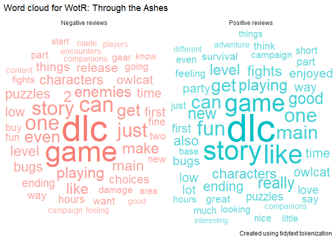<!-- -->

### Sentiment analysis:

Overall, the workflow I used is this: Set keywords to filter sentences
by -\> Filter out reviews without a text -\> Tokenize reviews by
sentences -\> Filter out sentences not containing keywords -\> Apply
sentimentr to get average sentiment for sentences -\> Filter out
sentiment equal to zero -\> Make charts for sentiments for the base game
and the DLC. Keep in mind, the final selection of the reviews with all
of the filters applied is not very big (see the summary table).

Let’s take a look at the number of words that appear in the reviews for
both games.

``` r
reviews_wordcount <- inner_join(game_freq_pos %>%
                      unique() %>% 
                      count(review_words), 
                      game_freq_pos %>%
                      unique() %>% 
                      count(review_words), by = "review_words") %>% 
  mutate(min_word_count = pmin(n.x, n.y)) %>% 
  select(review_words, min_word_count) %>% 
  filter(min_word_count > 5) %>% 
  arrange(desc(min_word_count))

reviews_wordcount %>% print()
```

    ## # A tibble: 4,001 × 2
    ##    review_words min_word_count
    ##    <chr>                 <int>
    ##  1 game                   6648
    ##  2 play                   3352
    ##  3 like                   2975
    ##  4 character              2492
    ##  5 story                  2489
    ##  6 bugs                   2470
    ##  7 good                   2466
    ##  8 great                  2350
    ##  9 just                   2299
    ## 10 time                   2286
    ## # … with 3,991 more rows

I’ve selected the words that have a noticeable difference in sentiment
between positive/negative reviews and are relevant for the analysis. As
I said earlier, sadly the review selection is not very big and sentiment
analysis might be biased.

``` r
#Setting the terms for sentiment analysis
game_terms <- c(
  "story",
  "price",
  "puzzles",
  "mechanics",
  "bugs",
  "character",
  "choices",
  "mythic",
  "crusade",
  "difficulty",
  "companions",
  "classes")

#Base Game
game_sentences <- basegame_cleared %>%
  ungroup() %>% 
  filter(language == "english") %>% 
  filter(nchar(review_text, type="chars") > 0) %>%
  select(review_id,voted_up,timestamp_created,review_text) %>% 
  unnest_tokens(review_sentence, review_text, token="sentences") %>% 
  filter(grepl(paste0(game_terms, collapse = "|"),review_sentence)) %>% 
  rowid_to_column("rowid")
#Getting sentiment scores and joining with review sentences
game_sentiments <- sentiment_by(game_sentences$review_sentence, game_sentences$rowid)
game_sentiments <- inner_join(game_sentiments, game_sentences)
#Spreading keywords
game_sentiments <- game_sentiments %>% 
  mutate(keywords = str_extract_all(review_sentence, paste(game_terms, collapse = "|")))
game_sentiments <- game_sentiments %>% 
  unnest(keywords) %>% 
  unique() %>% 
  mutate(game = Apps[1])
#Getting sentiments

#DLC1
#Getting sentences
dlc_sentences <- dlc1_cleared %>%
  ungroup() %>% 
  filter(language == "english") %>% 
  filter(nchar(review_text, type="chars") > 0) %>%
  select(review_id,voted_up,timestamp_created,review_text) %>% 
  unnest_tokens(review_sentence, review_text, token="sentences") %>% 
  filter(grepl(paste0(game_terms, collapse = "|"),review_sentence)) %>% 
  rowid_to_column("rowid")
#Getting sentiment scores and joining with review sentences
dlc_sentiments <- sentiment_by(dlc_sentences$review_sentence, dlc_sentences$rowid)
dlc_sentiments <- inner_join(dlc_sentiments, dlc_sentences)
#Spreading keywords
dlc_sentiments <- dlc_sentiments %>% 
  mutate(keywords = str_extract_all(review_sentence, paste(game_terms, collapse = "|")))
dlc_sentiments <- dlc_sentiments %>% 
  unnest(keywords) %>% 
  unique() %>% 
  mutate(game = Apps[2])

#DLC1
#Getting sentences
dlc2_sentences <- dlc2_cleared %>%
  ungroup() %>% 
  filter(language == "english") %>% 
  filter(nchar(review_text, type="chars") > 0) %>%
  select(review_id,voted_up,timestamp_created,review_text) %>% 
  unnest_tokens(review_sentence, review_text, token="sentences") %>% 
  filter(grepl(paste0(game_terms, collapse = "|"),review_sentence)) %>% 
  rowid_to_column("rowid")
#Getting sentiment scores and joining with review sentences
dlc2_sentiments <- sentiment_by(dlc2_sentences$review_sentence, dlc2_sentences$rowid)
dlc2_sentiments <- inner_join(dlc2_sentiments, dlc2_sentences)
#Spreading keywords
dlc2_sentiments <- dlc2_sentiments %>% 
  mutate(keywords = str_extract_all(review_sentence, paste(game_terms, collapse = "|")))
dlc2_sentiments <- dlc2_sentiments %>% 
  unnest(keywords) %>% 
  unique() %>% 
  mutate(game = Apps[3])

game_sentiments <- rbind(dlc_sentiments, game_sentiments, dlc2_sentiments)
```

Making a plot for sentence sentiment for the base game and the DLC:

``` r
game_sentiments %>% 
  filter(ave_sentiment != 0) %>% 
  group_by(keywords, game) %>% 
  summarise(average_sentiment = median(ave_sentiment)) %>% 
  #Putting the plot
  ggplot(aes(x = keywords, y  = average_sentiment, fill = keywords)) + 
  lims(y = c(-0.5,0.5)) +
  geom_col(
    position="stack") +
  labs(
    x = NULL,
    y = "Average Sentiment",
    title = "Sentence sentiments",
    subtitle = "Sentence sentiments for selected keywords for the base game and DLCs",
    caption = "Created using sentimentr package"
  ) + 
  #Adding labels
  geom_text(
    aes(label = round(average_sentiment,2)),
    size = 3
  ) + 
  theme(axis.text.x = element_text(vjust = 0.5, hjust=0.5, angle=45),
        legend.position="none") +
  facet_wrap(~game,
             ncol = 1)
```

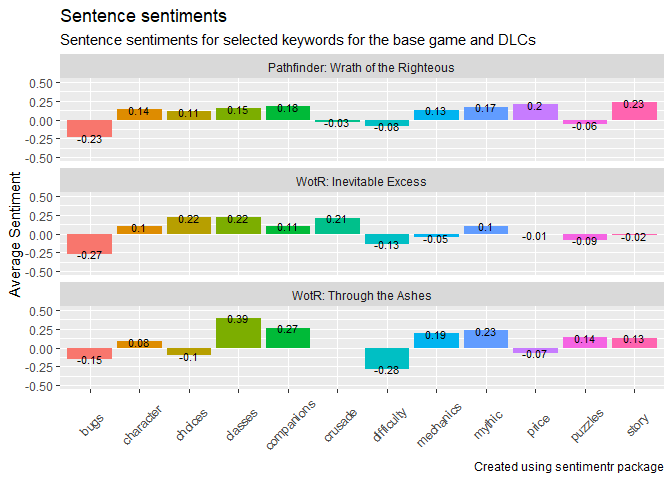<!-- -->

### Exporting data for Tableau

``` r
#For Windows, R 4.2.0+ is advised, otherwise UTF encoding might break
#Combined reviews csv
reviews_cleared %>%
  write.csv(paste0(c("data/tableau_reviews",".csv"), collapse=""), fileEncoding = "UTF-8", row.names = FALSE)
#Changed review opinion csv
reviews_cleared %>% 
  group_by(author.steamid) %>% 
  filter(n() == 2) %>% 
  select(author.steamid,game,voted_up) %>% 
  spread(game,voted_up) %>%
  rename(basegame_voteup = !!sym(Apps[1]),
         dlc_voteup = !!sym(Apps[2]),
         dlc2_voteup = !!sym(Apps[3])) %>% 
  #grouping up and  getting percentages
  mutate(Vote_change1 = case_when(
    (basegame_voteup & dlc_voteup) ~ "Remained positive",
    (basegame_voteup==TRUE & dlc_voteup==FALSE) ~ "Changed from positive to negative",
    (basegame_voteup==FALSE & dlc_voteup==TRUE) ~ "Changed from negative to positive",
    (basegame_voteup==FALSE & dlc_voteup==FALSE) ~ "Remained negative"
  ),
  Vote_change2 = case_when(
    (basegame_voteup & dlc2_voteup) ~ "Remained positive",
    (basegame_voteup==TRUE & dlc2_voteup==FALSE) ~ "Changed from positive to negative",
    (basegame_voteup==FALSE & dlc2_voteup==TRUE) ~ "Changed from negative to positive",
    (basegame_voteup==FALSE & dlc2_voteup==FALSE) ~ "Remained negative"
  ),
    Vote_change12 = case_when(
    (dlc_voteup & dlc2_voteup) ~ "Remained positive",
    (dlc_voteup==TRUE & dlc2_voteup==FALSE) ~ "Changed from positive to negative",
    (dlc_voteup==FALSE & dlc2_voteup==TRUE) ~ "Changed from negative to positive",
    (dlc_voteup==FALSE & dlc2_voteup==FALSE) ~ "Remained negative"
  ))
```

    ## # A tibble: 171 × 7
    ## # Groups:   author.steamid [171]
    ##    author.steamid    basegame_voteup dlc_voteup dlc2_voteup Vote_change1        
    ##    <chr>             <lgl>           <lgl>      <lgl>       <chr>               
    ##  1 76561197960896539 FALSE           FALSE      NA          Remained negative   
    ##  2 76561197961229178 FALSE           NA         FALSE       <NA>                
    ##  3 76561197962254366 TRUE            FALSE      NA          Changed from positi…
    ##  4 76561197963548788 TRUE            NA         FALSE       <NA>                
    ##  5 76561197965318189 TRUE            TRUE       NA          Remained positive   
    ##  6 76561197968581881 TRUE            NA         FALSE       <NA>                
    ##  7 76561197970374148 TRUE            FALSE      NA          Changed from positi…
    ##  8 76561197970707099 TRUE            NA         TRUE        <NA>                
    ##  9 76561197970901695 TRUE            TRUE       NA          Remained positive   
    ## 10 76561197976511951 FALSE           NA         FALSE       <NA>                
    ## # … with 161 more rows, and 2 more variables: Vote_change2 <chr>,
    ## #   Vote_change12 <chr>

``` r
  write.csv(paste0(c("data/tableau_opinionchange",".csv"), collapse=""), fileEncoding = "UTF-8", row.names = FALSE)
```

    ## "x"
    ## "data/tableau_opinionchange.csv"

``` r
#combined game sentiments csv
game_sentiments %>%
  write.csv(paste0(c("data/tableau_sentiments",".csv"), collapse=""), fileEncoding = "UTF-8", row.names = FALSE)

game_wordcounts <- game_freq_pos %>%
  mutate(review_group = case_when(
    (voted_up == TRUE) ~ "Positive reviews",
    (voted_up == FALSE) ~ "Negative reviews")) %>%
  group_by(review_group) %>% 
  count(review_words, sort = TRUE) %>%
  rename(word_count = n) %>% 
  mutate(count_normalise = word_count/sum(word_count)) %>% 
  slice_max(count_normalise, n = 100, with_ties = FALSE) %>% 
  as_tibble() %>% 
  mutate(game= Apps[1])
dlc_wordcounts <- dlc_freq_pos %>%
  mutate(review_group = case_when(
    (voted_up == TRUE) ~ "Positive reviews",
    (voted_up == FALSE) ~ "Negative reviews")) %>%
  group_by(review_group) %>% 
  count(review_words, sort = TRUE) %>%
  rename(word_count = n) %>% 
  mutate(count_normalise = word_count/sum(word_count)) %>% 
  slice_max(count_normalise, n = 100, with_ties = FALSE) %>% 
  as_tibble() %>% 
  mutate(game= Apps[2])

dlc2_wordcounts <- dlc2_freq_pos %>%
  mutate(review_group = case_when(
    (voted_up == TRUE) ~ "Positive reviews",
    (voted_up == FALSE) ~ "Negative reviews")) %>%
  group_by(review_group) %>% 
  count(review_words, sort = TRUE) %>%
  rename(word_count = n) %>% 
  mutate(count_normalise = word_count/sum(word_count)) %>% 
  slice_max(count_normalise, n = 100, with_ties = FALSE) %>% 
  as_tibble() %>% 
  mutate(game= Apps[3])

#combined wordcount csv
write.csv(rbind(game_wordcounts,dlc_wordcounts,dlc2_wordcounts),
          paste0(c("data/tableau_wordcounts",".csv"), collapse=""), fileEncoding = "UTF-8", row.names = FALSE)
```
